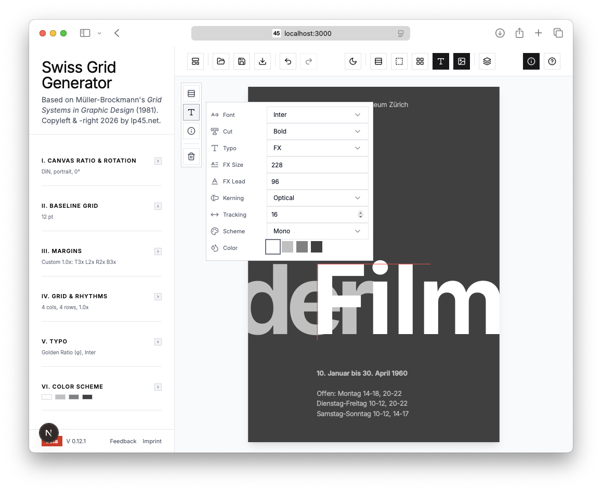

# Swiss Grid Generator

A toolkit for generating typographic grid systems based on Josef Müller-Brockmann's *[Grid Systems in Graphic Design](https://ia802309.us.archive.org/4/items/GridSystemsInGraphicDesignJosefMullerBrockmann/Grid%20systems%20in%20graphic%20design%20-%20Josef%20Muller-Brockmann_text.pdf)* (1981). Implements International Typographic Style (Swiss Style) principles for print and digital design.

**Live Preview:** [https://dev.lp45.net/swiss-grid-generator/](https://dev.lp45.net/swiss-grid-generator/)

## Overview

The Swiss Grid Generator provides tools for creating modular grid systems with baseline-aligned typography. It supports A-series paper formats (A0-A6) in portrait and landscape orientations, with customizable grid configurations and margin calculation methods.

## Screenshots

### Web Application 

**Live Preview:** [https://dev.lp45.net/swiss-grid-generator/](https://dev.lp45.net/swiss-grid-generator/)

### PDF Export


## Features

- A-series paper formats (A0-A6) in portrait/landscape
- Modular grids (1×1 to 13×13)
- Preview rotation slider (−80° to +80°)
- Three margin calculation methods:
  - Method 1: Progressive margins (1:2:2:3 — top:left:right:bottom)
  - Method 2: Van de Graaf ratios (2:3:4:6 — top:left:right:bottom)
  - Method 3: Baseline margins (1:1:1:1 — symmetric)
- Custom margin overrides with per-side baseline multipliers
- Adjustable gutter spacing (1×–4× baseline)
- 5-level typography system aligned to baseline grid with multiple hierarchy methods
- Real-time canvas preview with toggleable layers, rotation, and column-aware text flow
- Popup text editor on double-click with hierarchy selector (shows style `pt` sizes)
- Multiple export formats (JSON, TXT, PDF)

## Design Principles

The Swiss Grid Generator implements Müller-Brockmann's core teachings:

1. **Functional clarity** - Grid serves content, not vice versa
2. **Objective order** - Mathematical ratios, not arbitrary spacing
3. **Visual harmony** - All elements relate through consistent proportions
4. **Format scalability** - System works across all A-series formats

## Tech Stack

- **Framework** - Next.js 15 with App Router
- **Language** - TypeScript
- **Styling** - Tailwind CSS with custom animations
- **UI Components** - Radix UI primitives (Select, Slider, Switch, Tabs, Label)
- **PDF Generation** - jsPDF
- **Icons** - Lucide React

## Installation

```bash
cd webapp
```

```bash
npm install
```

## Development

```bash
npm run dev
```

Open [http://localhost:3000](http://localhost:3000) in your browser.

## Build

```bash
npm run build
```

Static files are exported to the `out/` directory.

## Configuration Options

### Paper Format

Select from A0 through A6 formats in either portrait or landscape orientation.

### Orientation

Choose portrait or landscape orientation for the selected format.

### Rotation

Rotate the preview from −80° to +80° in 1° steps.

### Margin Method

Choose from three calculation methods:

1. **Progressive (1:2:2:3)** - Top: 1×, Left: 2×, Right: 2×, Bottom: 3× baseline
2. **Van de Graaf (2:3:4:6)** - Top: 2×, Left: 3×, Right: 4×, Bottom: 6× baseline
3. **Baseline (1:1:1:1)** - Symmetric margins as baseline multiples

All margin methods support a baseline multiple slider (1×–7×) for scaling.
Custom margins allow per-side control (1×–9× baseline).

### Gutter

Configure columns (1–13) and rows (1–13) for your modular grid.
Gutter spacing is adjustable from 0.5× to 4× baseline, keeping gutters aligned to the baseline grid.

### Baseline Grid

Adjust the baseline unit from 6 to 72 points. Format-specific defaults are provided (A4: 12pt, A3: 13pt, etc.). All typography scales accordingly.

### Display Options

Toggle baselines, margins, gutter, and typography overlays. Choose display units (pt, mm, px) and preview zoom. Default zoom is Fit.

### Text Editing

Double-click any typography block in the preview to open a popup editor.

- Header controls:
  - Font hierarchy selector (`display`, `headline`, `subhead`, `body`, `caption`) with current `pt` size per option
  - `Save` button (enabled only when changes are made)
- Keyboard:
  - `Esc` closes the popup and discards unsaved changes
  - `Cmd/Ctrl + Enter` saves

## Typography System

The app includes a 5-level hierarchy aligned to the baseline grid (A4 reference, 12pt baseline). Swiss (Hand-tuned) is the default.

Available hierarchy methods:
- Swiss (Hand-tuned)
- Golden Ratio (φ)
- Fibonacci (8, 13, 21, 34, 55)
- Perfect Fourth (4:3)
- Perfect Fifth (3:2)

Compact formulas (A4 pt sizes, divide by 12 for ratios):

| Method | A4 Sizes (pt) (Caption → Display) |
|--------|---------------|
| Swiss | 7, 10, 20, 30, 64 |
| Golden Ratio (φ) | 10/φ, 10, 10φ, 10φ^2, 10φ^4 |
| Perfect Fourth (P4=4/3) | 10/P4, 10, 10P4^2, 10P4^3, 10P4^6 |
| Perfect Fifth (P5=3/2) | 10/P5, 10, 10P5, 10P5^2, 10P5^4 |
| Fibonacci | 8, 13, 21, 34, 55 |

| Style | Size | Leading | Baseline | Weight | Use Case |
|-------|------|---------|----------|--------|----------|
| display | 64pt | 72pt | 6× | Bold | Display titles, cover text |
| headline | 30pt | 36pt | 3× | Bold | Main headlines |
| subhead | 20pt | 24pt | 2× | Regular | Subheadings |
| body | 10pt | 12pt | 1× | Regular | Body text, paragraphs |
| caption | 7pt | 12pt | 1× | Regular | Captions, photo credits |

Preview layout rules:
- If `gridRows === 1`, text flows sequentially from the top with baseline spacing.
- If `gridRows` is 2–4, `display` starts at the top of row 1 and the rest starts in row 2.
- If `gridRows >= 5`, each paragraph starts at the top of the next available module row (dynamic, based on wrapped height).
- `subhead` and `body` always wrap to available width. If `gridCols >= 2`, they wrap to half-width columns.
- `headline` wraps to full width unless `gridCols >= 3`, in which case it uses `halfCols + 1` columns.
- `caption` wraps to full width unless `gridCols >= 2`, in which case it wraps to half-width.

## Component Structure

```
app/
├── layout.tsx              # Root layout with SEO metadata
├── page.tsx                # Main grid generator interface
├── globals.css             # Global styles and Tailwind directives

components/
├── grid-preview.tsx        # Canvas-based grid visualization
└── ui/                     # Radix UI primitives (shadcn/ui style)

lib/
├── grid-calculator.ts      # Core grid computation engine
└── utils.ts                # Utility functions (cn helper)
```

## Scripts

| Command | Description |
|---------|-------------|
| `npm run dev` | Start development server |
| `npm run build` | Build for production |
| `npm start` | Start production server |
| `npm run lint` | Run ESLint |

## Reference

*Müller-Brockmann, Josef. "Grid Systems in Graphic Design." Arthur Niggli Ltd, Teufen, 1981.*

## Copyleft & -right
[https://lp45.net/](https://lp45.net/)

## License

MIT
