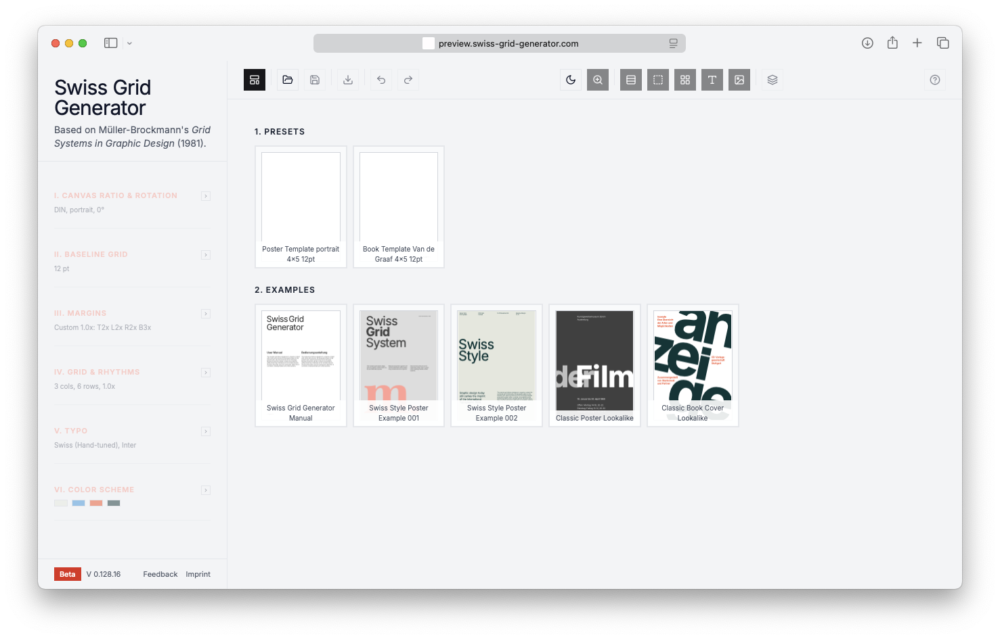
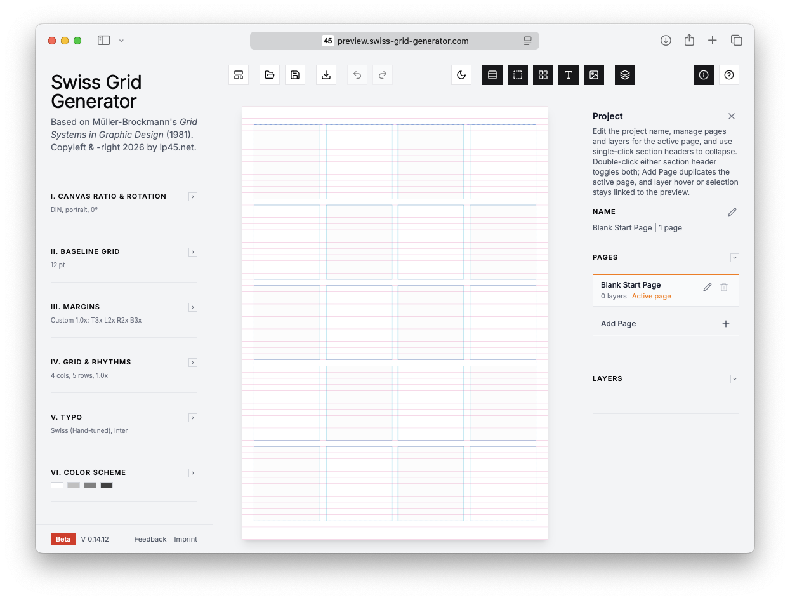
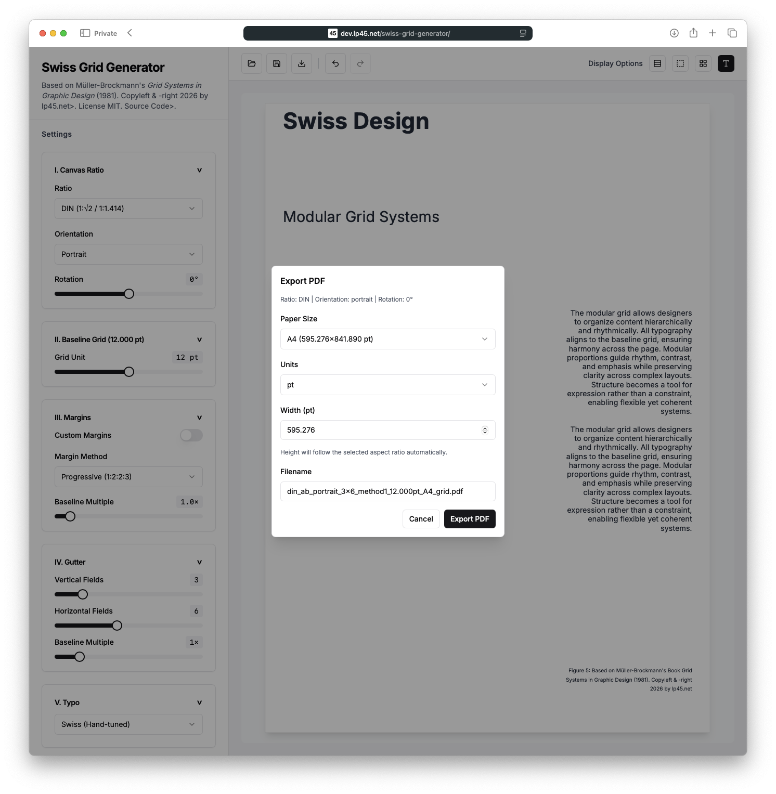
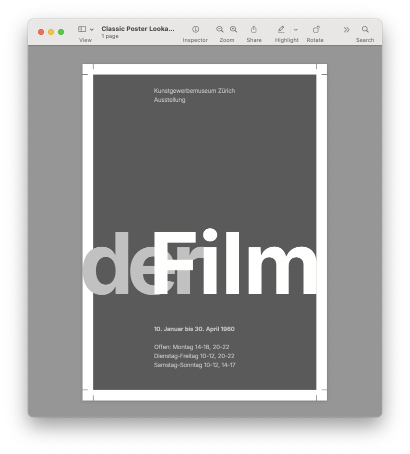

# Swiss Grid Generator

A toolkit for building typographic grid systems inspired by Josef Muller-Brockmann's *Grid Systems in Graphic Design*.

**Live preview:** [https://dev.lp45.net/swiss-grid-generator/](https://dev.lp45.net/swiss-grid-generator/)

## Overview

Swiss Grid Generator is a Next.js app for ratio-first grid construction, baseline-aligned typography, interactive preview editing, and layout export.

## Screenshots

### Web Application






### PDF Export


## Features

- Ratio-first canvas workflow (`DIN`, `ANSI`, `Balanced`, `Photo`, `Screen`, `Square`, `Editorial`, `Wide Impact`)
- Orientation + preview rotation controls
- Grid controls: columns/rows (`1..13`) and gutter multiple (`0.5..4.0`)
- Margin methods:
  - Progressive (`1:2:2:3`)
  - Van de Graaf (`2:3:4:6`)
  - Baseline (`1:1:1:1`)
- Custom margins with per-side multipliers
- 5-level baseline-aligned typography with scale presets:
  - Swiss, Golden Ratio, Fibonacci, Perfect Fourth, Perfect Fifth
- Interactive preview:
  - drag-and-snap text blocks
  - double-click popup editor
  - hover info tooltips
- Header icon actions:
  - Load JSON, Save JSON, Export PDF
  - Undo/Redo
  - Display toggles (baselines, margins, gutter/modules, typo)
- Reflow safety when grid changes:
  - warning dialog before rearrange
  - apply/cancel
  - post-apply undo toast
- Export popups:
  - Save JSON filename prompt (custom modal)
  - Export PDF with paper size, unit, width, filename

## Important Export Note

Current PDF export embeds the rendered preview image into a PDF page. It is a PDF container, but page content is currently rasterized preview output (not fully vector drawing commands).

## Installation

```bash
cd webapp
npm install
```

## Development

```bash
npm run dev
```

Open [http://localhost:3000](http://localhost:3000).

## Build

```bash
npm run build
```

## Configuration Summary

See full reference in [`SETTINGS.md`](SETTINGS.md).

Highlights:
- Baseline options: `6,7,8,9,10,11,12,14,16,18,20,24,28,32,36,48,60,72`
- Default baseline behavior in UI is anchored to A4 baseline (`12pt`)
- Rotation: `-80..80`
- Grid: cols/rows `1..13`
- Units in export popup: `pt`, `mm`, `px`

## Ratio Families and Paper Sizes

### DIN
- A6, A5, A4, A3, A2, A1, A0
- B6, B5, B4, B3, B2, B1, B0

### ANSI
- LETTER, LEGAL, ANSI_B, ANSI_C, ANSI_D, ANSI_E

### Single-size custom ratios
- BALANCED_3_4 (3:4)
- PHOTO_2_3 (2:3)
- SCREEN_16_9 (16:9)
- SQUARE_1_1 (1:1)
- EDITORIAL_4_5 (4:5)
- WIDE_2_1 (2:1)

## Undo / Redo

Undo/redo is available via header icons and keyboard shortcuts:
- `Cmd/Ctrl+Z`
- `Cmd/Ctrl+Shift+Z` or `Cmd/Ctrl+Y`

Includes:
- settings changes (ratio, grid, margins, toggles, etc.)
- preview block edits/moves
- structural reflow apply/cancel flows

## Tech Stack

- Next.js 15 (App Router)
- TypeScript
- Tailwind CSS
- Radix UI primitives
- jsPDF
- Lucide React

## Project Structure

```text
webapp/
├── app/
│   ├── layout.tsx
│   ├── page.tsx
│   └── globals.css
├── components/
│   ├── grid-preview.tsx
│   └── ui/
└── lib/
    ├── grid-calculator.ts
    └── utils.ts
```

## Scripts

| Command | Description |
|---|---|
| `npm run dev` | Start dev server |
| `npm run build` | Production build |
| `npm start` | Start production server |
| `npm run lint` | Next lint command |

## Reference

Josef Muller-Brockmann, *Grid Systems in Graphic Design*.

## License

MIT
