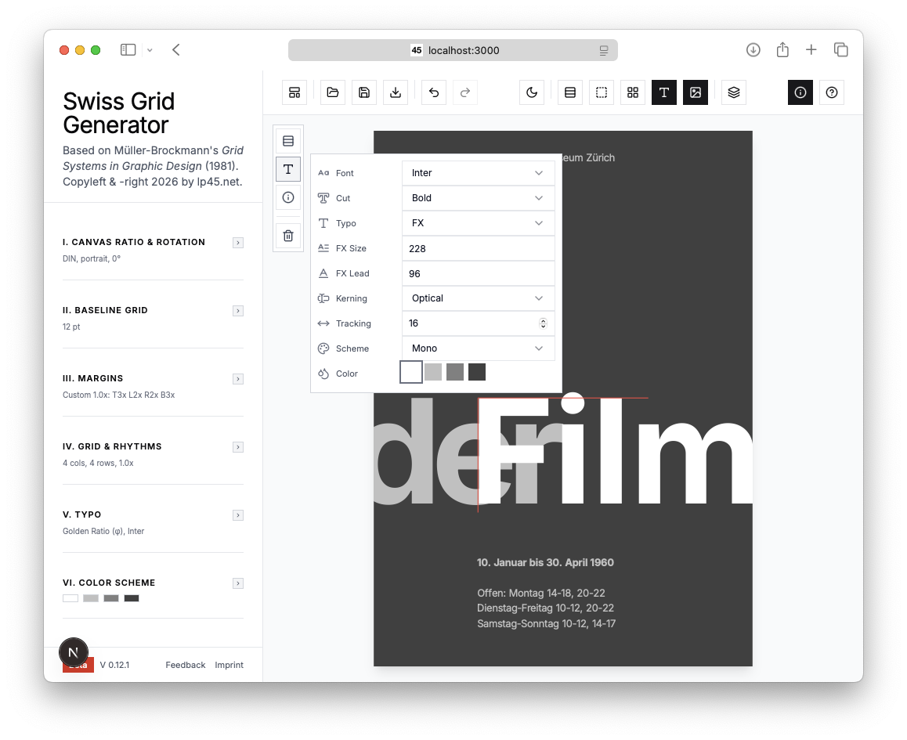

# Swiss Grid Generator

A precise, production-oriented layout tool inspired by **Josef Müller-Brockmann** and the Swiss International Typographic Style.

Build beautiful, rhythmical compositions with authentic baseline grids, progressive margins, modular fields, and flexible typographic systems — all in the browser.

Implementation-accurate reference docs live in [SETTINGS.md](SETTINGS.md), [CALCULATIONS.md](CALCULATIONS.md), and [FEATURES.md](FEATURES.md).

[Try it live →](https://preview.swiss-grid-generator.com)

---

## ✨ Why Swiss Grid Generator?

This is not just another grid calculator.

It’s a thoughtful digital interpretation of Müller-Brockmann’s *Grid Systems in Graphic Design* — designed for designers, students, and typographers who want to work with real Swiss principles: clarity, rhythm, proportion, and precision.

Whether you're creating posters, editorial spreads, books, or experimental layouts, Swiss Grid Generator gives you powerful, authentic tools without getting in your way.

## Screenshots

### Web Application

### PDF Export

---

## 🚀 Current Features

### Canvas & Format
- Multiple ratio families: **DIN, ANSI, Balanced, Photo, Screen, Square, Editorial, Wide Impact, Custom Ratio**
- Portrait / Landscape orientation
- Full canvas rotation (-180° to 180°)
- Custom width:height ratios resolved to A4-equivalent page area
- Multi-page project support with independent page settings

### Baseline Grid
- 18 baseline options (6 pt to 72 pt)
- All vertical rhythm derived from the baseline
- Typography leading and margins stay aligned to baseline multiples
- Stable positioning — changing baseline doesn’t break your layout

### Margins
- Three classic systems:
  - Progressive (1:2:2:3)
  - Van de Graaf (2:3:4:6)
  - Baseline (1:1:1:1)
- `Custom Margins` available as the last option in the margin-method dropdown
- Shared baseline multiple scaling
- Full custom margin control

### Grid & Rhythms (The Star Feature)
- 1–13 columns and rows
- Smart gutters (1.0× to 4.0× in 0.5 steps)
- Five authentic rhythm modes:
  - Repetitive (Block)
  - Fibonacci
  - Golden Ratio (Φ)
  - Perfect Fourth
  - Perfect Fifth
- Independent rhythm control for rows and columns
- 90° rhythm rotation
- Stable logical positioning — paragraphs and image placeholders stay where you placed them
- Paragraphs and image placeholders both support independent X/Y snap control plus per-layer rotation
- Grid reductions are blocked with a calm warning instead of auto-repositioning conflicting content

### Typography System
- Five harmonious type scales (Swiss, Golden Ratio, Fibonacci, Perfect Fourth, Perfect Fifth)
- Six hierarchy levels: **Display · Headline · Subhead · Body · Caption · Custom**
- The left `Font Hierarchy` table shows **Display · Headline · Subhead · Body · Caption**; `Custom` is paragraph-level and seeds from the paragraph's current size/leading when first selected
- Available Fonts:
  - **Sans-Serif**: [Inter](https://fonts.google.com/specimen/Inter), [Work Sans](https://fonts.google.com/specimen/Work+Sans), [Jost](https://fonts.google.com/specimen/Jost), [IBM Plex Sans](https://fonts.google.com/specimen/IBM+Plex+Sans), [Libre Franklin](https://fonts.google.com/specimen/Libre+Franklin)
  - **Serif**: [EB Garamond](https://fonts.google.com/specimen/EB+Garamond), [Libre Baskerville](https://fonts.google.com/specimen/Libre+Baskerville), [Bodoni Moda](https://fonts.google.com/specimen/Bodoni+Moda), [Besley](https://fonts.google.com/specimen/Besley)
  - **Poster**: [Playfair Display](https://fonts.google.com/specimen/Playfair+Display)
- Paragraph-level geometry plus horizontal/vertical alignment and selection-level font family, cut, hierarchy, color, and tracking
- Paragraph and image-placeholder height can be composed as `rows + baselines`, including shallow frames such as `0 rows + 1 baseline`
- Paragraph vertical alignment (`Top`, `Center`, `Bottom`) stays baseline-aligned inside the configured frame height
- Optical/metric kerning toggle with shared render/export behavior
- Dynamic document variables for editorial folios and proof lines: `<% project_title %>`, `<% title %>`, `<% page %>`, `<% pages %>`, `<% date %>`, `<% time %>`
- In text edit mode, placeholders resolve on the page while the raw tokens remain stored in the source text
- Inline editor caret and selection follow rendered text geometry
- Live character & word count

### Project & Layers
- Full **Project → Pages → inline Layers** architecture
- Multiple pages with independent settings
- Project rail uses page cards with inline open/close layer stacks for faster long-document navigation
- `Page Up` / `Page Down` step to the previous or next project page when multiple pages are present, and `Home` / `End` jump to the first or last page
- Text and image layers with stable grid-based positioning
- Drag to move, Alt/Option+drag to duplicate
- Logical anchoring (Column × Row + Baseline Offset)
- Increasing a paragraph's column span preserves its anchored column, even when the wider frame intentionally overhangs the page edge
- Bundled presets now use the same project JSON schema as saved documents

### Preview & Interaction
- Live WYSIWYG canvas
- Smart text-edit zoom is enabled by default and can be toggled from the header; entering text edit mode focuses the active paragraph, stays stable through ordinary text/style edits, and refits only when the paragraph frame geometry changes (`Rows`, `Baselines`, `Cols`)
- Supported layout and editor dropdowns preview hovered items live in the page; closing a menu without selecting restores the committed state
- Toggle visibility of baselines, margins, modules, and typography
- Double-click empty module → create text
- Shift + double-click → create image placeholder
- Image placeholders use the same `Snap to Columns (X)` / `Snap to Baseline (Y)` placement model as paragraphs
- With `Snap to Columns (X)` off, paragraphs and image placeholders can overhang one column into either side margin
- Hover interactions and edit affordances
- Paragraph hover guides resolve from the configured `rows + baselines` height, and the paragraph edit icon sits at the block's top-left origin for shallow frames
- When a text or image editor is open, preview hover stays active on other blocks and a single click retargets the already open editor
- Text and image editors reuse the left-sidebar section pattern instead of a preview-docked rail
- Text and image geometry editors include bounded `Baselines` dropdowns based on the active document's baselines-per-grid-module count
- Text editor family, cut, hierarchy, and geometry dropdowns preview on rollover before commit; image editor geometry and scheme dropdowns do the same
- Text editor includes a `Placeholders` section so document variables can be inserted by click
- Text paragraphs support horizontal (`Left`, `Center`, `Right`) and vertical (`Top`, `Center`, `Bottom`) frame alignment in the editor
- In text edit mode, double-click selects the clicked word, triple-click selects the containing sentence, `Alt+A` / `Cmd/Ctrl+A` select the whole paragraph, and `Arrow` / `Home` / `End` navigation follows the rendered line geometry
- Image placeholder editor uses `Geometry`, `Color`, and `Info` sections, including scheme, swatch color, and transparency controls

### Export
- High-quality vector **PDF export**
- Trim-size **SVG v1 export** with exact glyph-outline typography
- **IDML v1 export** for InDesign continuation
- Export opens with the full project page range selected by default
- `PDF`, `SVG`, and `IDML` all export the selected page range using each page's stored document size
- All export formats are vector-based rather than raster screenshot captures
- Multi-page `SVG` export downloads a ZIP with one SVG per page
- PDF print options: bleed, registration-style marks, and output intents
- PDF presets: **Digital Print** (RGB / sRGB) and **Press Proof** (CMYK / FOGRA39)
- Use `SVG` or `IDML` when you need typography frozen as non-live geometry
- `SVG` converts typography to exact glyph outlines, so exported text is not live-editable
- `IDML` separates **Guides**, **Typography**, and **Placeholders** into distinct layers and freezes typography geometry

### Extras
- Undo / Redo
- Dark mode
- Presets browser with rendered page-1 thumbnails
- Comprehensive keyboard shortcuts
- Helpful warning system (no auto-repositioning on invalid grid reductions)

---

## 🎯 Who is it for?

- Graphic design students learning Swiss typography
- Professional designers working in editorial, poster, or branding
- Typographers who value rhythm and precision
- Anyone who wants to work with authentic Müller-Brockmann principles in a modern tool

---

## 🛠 Tech Stack

- Next.js 15 (App Router)
- TypeScript
- Tailwind CSS + Radix UI
- Canvas rendering with custom rhythm engine
- Zustand for state management
- jsPDF for print output

---

## 📥 Getting Started

1. Visit **[preview.swiss-grid-generator.com](https://preview.swiss-grid-generator.com)**
2. Start with one of the bundled presets or build from scratch
3. Explore the rhythm modes — they’re the soul of the tool

---

## License

MIT © [lp45.net](https://lp45.net)

---

**Made with precision and love for Swiss typography.**

If you enjoy the tool, feel free to share it with fellow designers and students. Feedback and contributions are always welcome!

---
