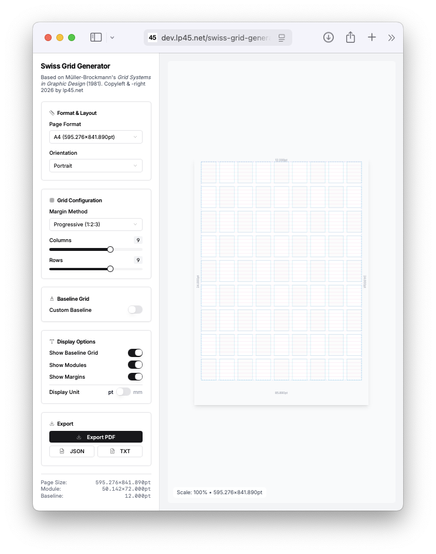

# Swiss Grid Web App

Interactive web application for generating and visualizing Swiss Style typographic grid systems based on Josef Müller-Brockmann's *Grid Systems in Graphic Design* (1981).

**Live Preview:** [https://dev.lp45.net/swiss-grid-generator/](https://dev.lp45.net/swiss-grid-generator/)



## Features

- **Interactive Controls** - Real-time grid configuration with intuitive UI components
- **Live Preview** - Instant visual feedback as you adjust parameters
- **PDF Export** - Download grid specifications as PDF documents
- **Responsive Design** - Works on desktop and mobile devices
- **Dark Mode** - Toggle between light and dark themes

## Tech Stack

- **Framework** - Next.js 15 with App Router
- **Language** - TypeScript
- **Styling** - Tailwind CSS with custom animations
- **UI Components** - Radix UI primitives (Select, Slider, Switch, Tabs, Label)
- **PDF Generation** - jsPDF
- **Icons** - Lucide React

## Installation

```bash
npm install
```

## Development

```bash
npm run dev
```

Open [http://localhost:3000](http://localhost:3000) in your browser.

## Build

```bash
npm run build
```

The optimized production build will be in the `.next` folder.

## Static Export

The app is configured for static export. To build a static version:

```bash
npm run build
```

The static files will be in the `out/` directory.

## Configuration Options

### Paper Format

Select from A0 through A6 formats in either portrait or landscape orientation.

### Grid Dimensions

Configure columns (1-13) and rows (1-13) for your modular grid.

### Margin Method

Choose from three calculation methods:
1. **Progressive (1:2:3)** - Top: 1×, Bottom: 3×, Sides: 2× baseline
2. **Van de Graaf (2:3:4:6)** - Inner: 2×, Top: 3×, Outer: 4×, Bottom: 6× baseline
3. **Grid-Based** - Margins equal to one module width/height

### Baseline Grid

Adjust the baseline unit from 6 to 24 points. All typography scales accordingly.

## Typography System

The app includes 10 styles aligned to the baseline grid:

| Style | Use Case |
|-------|----------|
| caption | Small captions, photo credits |
| footnote | Footnotes, references |
| body | Body text, paragraphs |
| lead | Lead paragraphs, pull quotes |
| subhead_small | Small subheadings |
| subhead_medium | Medium subheadings |
| headline_3 | Level 3 headlines |
| headline_2 | Level 2 headlines |
| headline_1 | Level 1 headlines |
| display | Display titles, cover text |

## Component Structure

```
app/
├── layout.tsx          # Root layout with theme provider
├── page.tsx            # Main page with grid generator
├── globals.css         # Global styles and Tailwind directives

components/
└── ui/                 # Reusable UI components (shadcn/ui style)

lib/
└── utils.ts            # Utility functions (cn helper)
```

## Scripts

| Command | Description |
|---------|-------------|
| `npm run dev` | Start development server |
| `npm run build` | Build for production |
| `npm start` | Start production server |
| `npm run lint` | Run ESLint |

## Reference

*Müller-Brockmann, Josef. "Grid Systems in Graphic Design." Arthur Niggli Ltd, Teufen, 1981.*
